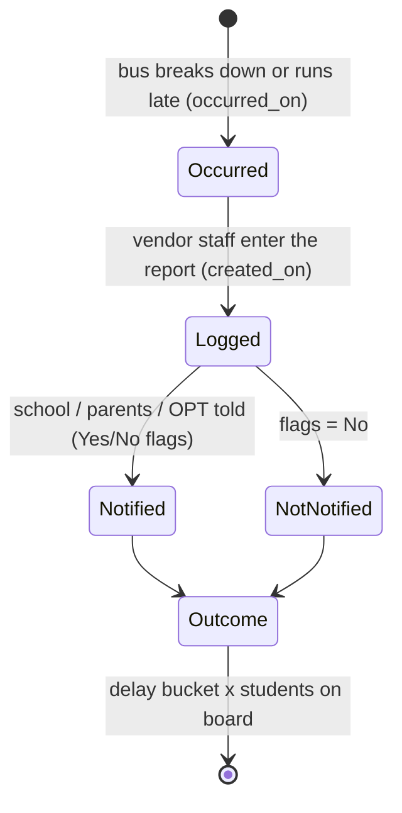
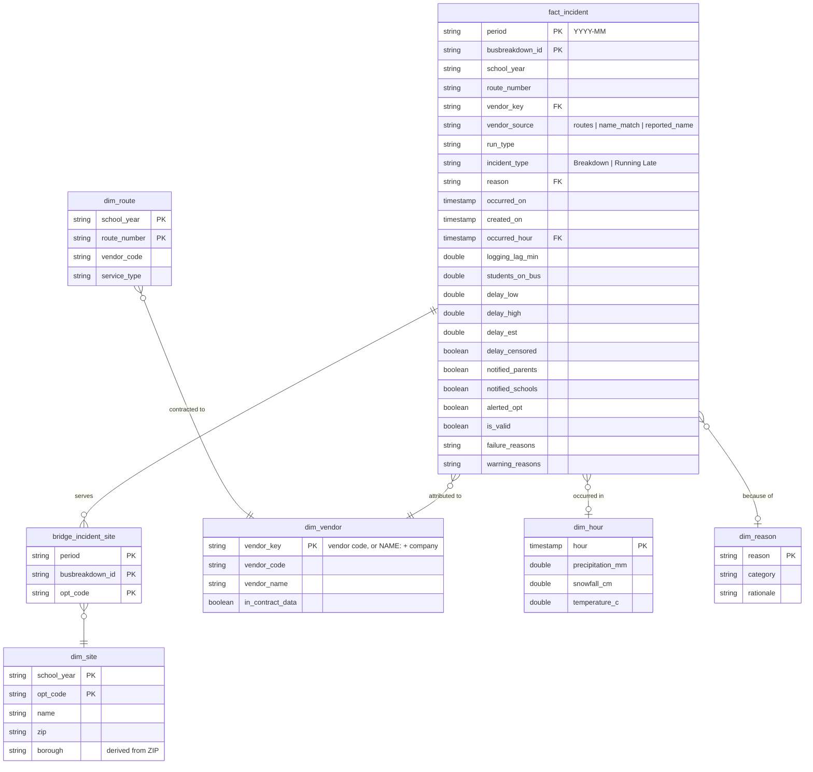

# Workflow, data model and metrics

## The workflow

Every incident moves through the same lifecycle. The first three steps have a timestamp in the data;
the outcome is the delay and the number of students affected.

`informed_on` looks like a notification timestamp but equals `created_on` in every row, so it is stamped by the
system when the report is saved. The model leaves it out rather than build a metric on it.

| Concept | In this project |
|---|---|
| **Entities** | Incident, vendor, route, school/site, hour (weather), delay reason |
| **Events / states** | Occurred → logged → notified (or not) |
| **Interventions** | OPT audits or penalises a vendor; OPT requires automated GPS-based notification |
| **Outcomes** | Delay minutes, students affected, whether families were told |

## Star schema (DuckDB)

Defined in [`src/sql/schema.sql`](../src/sql/schema.sql).

| Table | Grain | Rows (22 months) | Notes |
|---|---|---|---|
| `fact_incident` | one incident | 162,766 | Invalid rows kept (metrics filter on `is_valid`); later copies of duplicate IDs left out |
| `bridge_incident_site` | one incident × school served | 422,193 | Never count incidents from this table |
| `dim_route` | one contracted route per school year | 20,707 | **All** routes, not only those with incidents — it is the M4 denominator |
| `dim_vendor` | one vendor | 60 | Contract vendors (including some with no incidents) plus name-only vendors (mostly Pre-K), flagged `in_contract_data = false`; 58 have incidents |
| `dim_site` | one site per school year | 12,892 | Borough from ZIP prefix; `city_reported` kept alongside |
| `dim_hour` | one hour | one per hour of each month | Only the month's hours (the pull includes 3 look-back days) |
| `dim_reason` | one delay reason | 10 | From `reference/reason_categories.csv` |

## Who is responsible? Delay reason categories

| Category | Reasons | Share of incidents | Why |
|---|---|---|---|
| vendor-controllable | Mechanical Problem, Won't Start, Flat Tire | 4.7% | Vehicle maintenance is the vendor's job |
| route design | Problem Run | 7.1% | The NYC Council links problem runs to poorly designed routes — OPT designs routes, so vendors aren't blamed for them |
| external | Heavy Traffic, Weather Conditions, Accident, Delayed by School, Late return from Field Trip | 70.7% | Outside the vendor's control on the day (accident fault isn't recorded) |
| unknown | Other, anything unmapped | 17.5% | No information; new reasons are logged as warnings |

## The metrics

Project KPI: **M1, the parent notification rate.** All five metrics come from
[`src/sql/vendor_scorecard.sql`](../src/sql/vendor_scorecard.sql) and [`src/metrics.py`](../src/metrics.py).

| # | Metric | Definition | Rows used |
|---|---|---|---|
| **M1** | Parent notification rate *(KPI)* | incidents with parents notified = Yes ÷ incidents where the flag is Yes or No | valid rows; labelled **vendor-claimed** |
| **M2** | Logging lag | median of `created_on − occurred_on` in minutes, and % logged within 15 minutes | valid rows |
| **M3** | Student-minutes delayed | Σ (delay estimate × students on board), with a low–high range from the bucket bounds | valid Running Late rows with a readable delay and a plausible student count; **a lower bound** |
| **M4** | Incidents per 100 contracted routes | valid incidents ÷ routes the vendor holds that school year × 100; also the vendor-controllable version | contract vendors only; not computed for summer months |
| **M5** | Data-trust score | % of the vendor's incidents that are valid and have none of V03, V06, V07, V09, V10, V12 | all rows (failing rows are what lowers trust) |

### From metrics to a decision: the audit rule

A vendor with at least 30 incidents in the month goes on the audit list if any trigger fires:

- **M1** — notification rate in the bottom quartile of ranked vendors
- **M4** — **vendor-controllable** incidents per 100 routes in the top quartile (all-cause M4 is shown but not used:
  a vendor shouldn't be audited for traffic)
- **M5** — trust score below 90%

Quartiles are relative, so every month names somebody. The cross-month summary therefore ranks vendors by the
**share of months** they were on the list — a vendor flagged 20 months out of 20 is a much stronger case than one
bad month.
