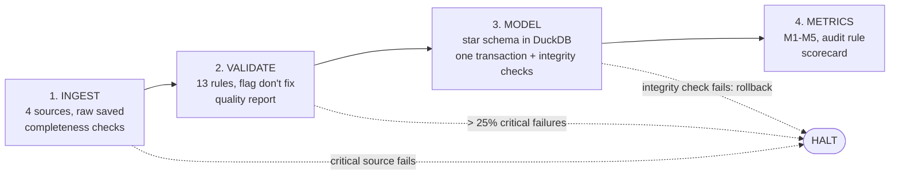

# The pipeline

## Run it

```bash
python pipeline.py --month 2025-10                  # one month
python pipeline.py --month 2025-10 --force          # re-download even if a good pull exists
python pipeline.py --range 2024-09 2026-06          # backfill; also writes the cross-month summary
pytest                                              # 142 tests, no network needed
```

Exit code 0 = every month succeeded or ran degraded; 1 = at least one month halted.

## Stages



| Stage | Code | Output |
|---|---|---|
| Ingest | [`src/ingest/`](../src/ingest/) | `data/raw/<source>/<month or school year>/<run_id>/` |
| Validate | [`src/validate/`](../src/validate/), [`src/parse_delay.py`](../src/parse_delay.py) | `data/processed/incidents/<month>/incidents_validated.parquet`, quality report |
| Model | [`src/model.py`](../src/model.py), [`src/sql/schema.sql`](../src/sql/schema.sql) | `data/warehouse.duckdb` |
| Metrics | [`src/metrics.py`](../src/metrics.py), [`src/sql/vendor_scorecard.sql`](../src/sql/vendor_scorecard.sql) | metrics CSV, vendor scorecard CSV + Markdown |
| Summary | [`src/summary.py`](../src/summary.py) | `data/output/summary/` (after `--range`) |

## How we know retrieval is complete

| Source | Check |
|---|---|
| Incidents (API) | Ask for `count(*)` first, page through ordered by ID, then require received = expected, no duplicate IDs, every row inside the month, and at least one row |
| Routes, Sites (CSV) | File not empty, required columns present, rows exist for the school year, row count within ±20% of the previous download; MD5 and size recorded |
| Weather (API) | One row per hour of the month plus the 3 look-back days (±1 for daylight saving), no missing precipitation |

Raw downloads are **write-once**. A download only counts once its folder has `_SUCCESS.json`; failed pulls are kept as
evidence but never reused. Without `--force`, a later run reuses the last good download (a weather pull made with a
different look-back window is fetched again).

## Failure handling: halt or degrade

Decided by how much the KPI depends on the source.

| Situation | Action | Why |
|---|---|---|
| Incident API down, count mismatch, 0 rows | **Halt** the month | The KPI is this data |
| Routes download fails | Fall back to the last good copy; **halt** if none exists | Vendor attribution is central to the decision |
| No Routes/Sites rows for the school year | **Degrade** | Vendors fall back to reported names |
| Sites or weather unavailable | **Degrade**; dependent rules marked *skipped* | Enrichment only |
| Month not finished yet | **Degrade** | Counts are partial |
| > 25% of rows fail critical rules | **Halt** after writing the quality report | Something upstream is broken |
| Model integrity check fails | **Halt** and roll back | Warehouse stays as it was |
| Any unexpected error | Recorded as `failed` with the stage and error | Never a silent crash |

Network calls retry 3 times (2, 4 and 8 seconds) on timeouts, 429 and 5xx; other errors (e.g. 404) are not retried.

A real run showing all three outcomes:

```
month    status    halted    incidents      M1  audit
2026-08  failed    ingest            -       -      -     <- API returns 0 incidents; past Augusts had 659-1,032
2026-09  degraded  -              4791   37.1%      6     <- no 2026-27 reference data, month unfinished
2026-10  failed    ingest            -       -      -     <- future month
```

## Rerun behaviour

- Reloading a month deletes and re-inserts that month's rows inside one transaction; other months are untouched.
- Output files are written to a temp file and renamed, so a crash never leaves half a file.
- Rows are written in a fixed order, so a rerun produces **byte-identical** outputs (only the manifest's run id and
  timestamps change). Tested for a plain rerun and for a forced full re-download.
- If a rerun fails, the previous good outputs stay in place with their own manifest.

## Run manifest

Every run writes a JSON manifest per month: status, stage where it halted and the error, degraded and scope notes,
each source's status, rows and checks, every rule's count, the model's integrity checks, output paths, the git commit
(and whether there were uncommitted changes) and a hash of `config.yaml`. Paths are relative to the project.

- `logs/manifests/run_<run_id>_<month>.json` — every run, including failures
- `data/output/<month>/run_manifest.json` — only when outputs were produced, so it always describes the files next to it

## Tests

`pytest` runs 142 tests in under a minute without network access: config helpers, HTTP retries, each source's
completeness checks, the delay parser (including all 1,922 real legacy spellings), every validation rule, the model
(rerun, rollback, bridge, duplicates), the metrics and audit rule, and end-to-end runs against a fake internet (success,
rerun, forced rerun, API down, weather down, failed rerun keeps old outputs, backfill with a bad month, summer month,
unexpected bug).
