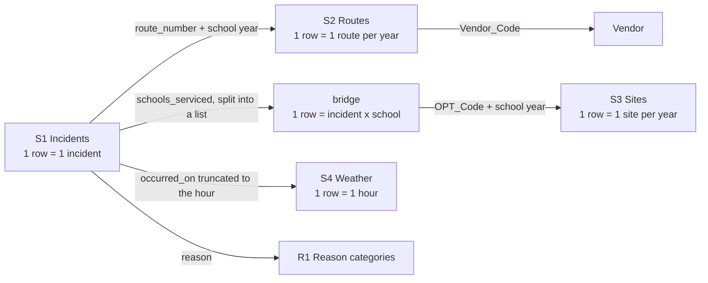

# Source map

How each business question leads to the information needed and the system that holds it,
who owns each source, what one row means, and what the sources can't tell us.

## Business question → information → source

| Business question | Information needed | Source |
|---|---|---|
| Are parents told when a bus is late or breaks down? | Notification flags per incident | S1 Incidents |
| Which vendor is responsible for an incident? | Route → vendor contract per school year | S2 Routes (via `route_number`) |
| Is a vendor bad, or just big? | Number of routes each vendor holds | S2 Routes (denominator for M4) |
| How many children were affected, and for how long? | Students on board, delay length | S1 Incidents |
| Which schools and boroughs are affected? | School location | S3 Transportation Sites |
| Are "weather" delay reasons genuine? | Actual rain, snow and temperature | S4 Weather |
| Is the vendor-reported data trustworthy? | Results of our validation rules | Derived by the pipeline |

## Sources

| # | Source | Owner / system | Retrieval mode | Grain (1 row =) | Key fields | Known gaps |
|---|---|---|---|---|---|---|
| S1 | [Bus Breakdown and Delays](https://data.cityofnewyork.us/Transportation/Bus-Breakdown-and-Delays/ez4e-fazm) `ez4e-fazm` | NYC DOE Office of Pupil Transportation (OPT); **typed in by vendor staff** | Socrata API (SoQL, paginated JSON) | one incident report | `busbreakdown_id`, `route_number`, `occurred_on`, `created_on`, `informed_on`, `how_long_delayed`, `reason`, notification flags, `number_of_students_on_the_bus`, `schools_serviced`, `run_type` | Self-reported; no actual arrival time; OPT states it "does not systematically monitor" the delay and notification fields |
| S2 | [Routes](https://data.cityofnewyork.us/d/8yac-vygm) `8yac-vygm` | OPT | CSV bulk download (file) | one route in one school year | `School_Year`, `Route_Number`, `Vendor_Code`, `Vendor_Name`, `Service_Type` | Route paths withheld for student privacy; no Pre-K curb-to-curb routes; describes school-year contracts, not summer service |
| S3 | [Transportation Sites](https://data.cityofnewyork.us/d/hg3c-2jsy) `hg3c-2jsy` | OPT | CSV bulk download (file) | one school/site in one school year | `School_Year`, `OPT_Code`, `Name`, `Zip`, `Latitude`, `Longitude` | `City` is ~83% empty in 2024-26, so borough is derived from ZIP |
| S4 | [Open-Meteo historical weather](https://open-meteo.com/en/docs/historical-weather-api) | Open-Meteo (third party) | REST API (JSON, no key) | one hour at one NYC point (40.71, -74.01) | `precipitation`, `snowfall`, `temperature_2m` | City-wide, not per borough; archive lags a few days behind today |
| R1 | [`reference/reason_categories.csv`](../reference/reason_categories.csv) | Us (hand-built) | File (CSV) | one delay reason | `reason`, `category`, `rationale` | A judgement call, documented per row |
| — | DuckDB warehouse | Us | SQL | see [data_model.md](data_model.md) | | Rebuilt by the pipeline, not committed |

Retrieval modes used: **API** (S1, S4), **file** (S2, S3, R1) and **SQL** (DuckDB, which also reads the raw CSVs directly).

## How the sources join

### Join decisions

- **Vendor comes from `route_number`, not the company name typed in the incident.** The route key is OPT's
  contract data; names are free text (2016 records even have truncated names such as `"RELIANT TRANS, INC. (B232"`).
  When the route isn't in the contract data, we fall back to an exact name match, then to the typed name,
  and record which method was used (`vendor_source`). Over 22 months: 88.9% routes, 2.7% name match, 8.4% typed name.
- **Summer months (July, August) don't use route contracts.** The same routes are reported by different companies in
  summer (57-65% mismatch) but never in October, so the Routes table doesn't describe summer operators.
- **`schools_serviced` is a comma-separated list** — 70% of incidents serve more than one school. It becomes a bridge
  table so an incident is never counted once per school.
- **Every reference join includes the school year**, because a route can move to another vendor the next year.
- **The school year runs July to June.** Summer incidents are labelled with the upcoming school year
  (e.g. July 2025 → `2025-2026`).

## Gaps found in the sources

| Gap | Evidence | Consequence |
|---|---|---|
| No real notification time | `informed_on` equals `created_on` in every row (167,557 checked) | Notification is measured by Yes/No flags only; no notification-lag metric |
| Delay is capped | Dropdown's top option is "61-90 Min"; 27.3% of late incidents use it | Student-minutes is a lower bound |
| Reference data missing for some years | Routes/Sites have (almost) nothing for 2020-21 to 2023-24, nothing yet for 2026-27 | Scope is 2024-25 and 2025-26; other years run degraded |
| Summer 2026 not published | July and August 2026 return 0 incidents; past summers had 659-2,610 per month | Those months halt instead of reporting zero |
| Future-dated incident | One record has `occurred_on` in February 2027 | Rule V05 flags it if that month is run |
| Borough not reliable | `boro` in S1 includes New Jersey, Connecticut, Nassau; S3 `City` is 83% empty | Borough derived from the site's ZIP code |
